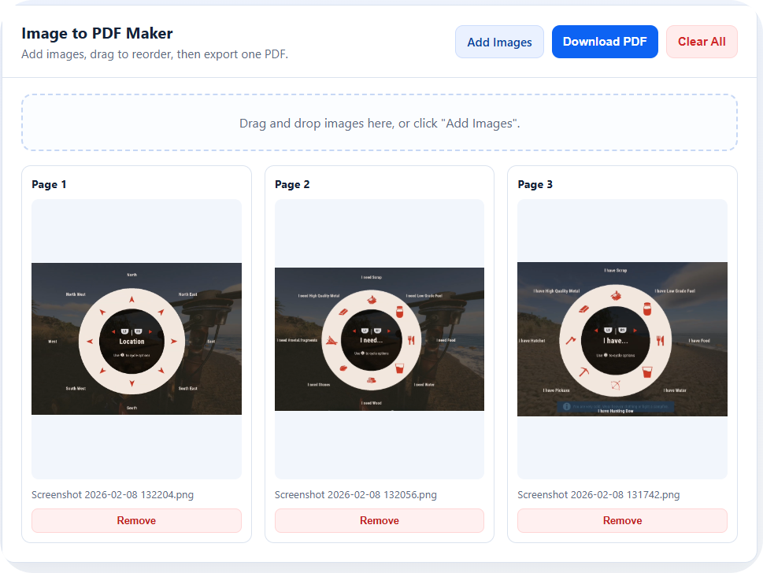

# Image to PDF Maker

A fast, no-build web app that turns multiple images into one PDF, with drag-and-drop page ordering.


## Why This Exists

Most converters are bloated or locked behind paywalls. This project keeps it simple:

- Add a bunch of images
- Reorder pages visually by dragging previews
- Export one clean PDF with one image per page

## Features

- Multi-image upload (`Add Images` button or drag/drop)
- Large visual previews for easier page ordering
- Drag-and-drop reordering of pages
- Remove single images or clear all
- One-click PDF export
- Fully client-side (your files stay in your browser session)

## Preview



## Demo / Run Locally

No install needed.

1. Clone or download this repo.
2. Open `index.html` in your browser.
3. Upload images, reorder, and click `Download PDF`.

## Tech Stack

- HTML
- CSS
- Vanilla JavaScript
- [jsPDF](https://github.com/parallax/jsPDF) (CDN)

## How It Works

1. Images are loaded with `FileReader` as data URLs.
2. Previews are rendered as draggable cards.
3. Card order controls page order in the final PDF.
4. `jsPDF` creates a page per image using each image's dimensions.

## Deploy (Static Hosting)

This app is a single static file, so it works on:

- GitHub Pages
- Netlify
- Vercel (static)
- Any basic web host

## Project Structure

```text
.
|-- index.html
|-- README.md
```

## Notes

- Very large images may create large PDFs.
- Browser memory limits can affect extremely large batches.

---

**Developed by VirtuallyCracked**
